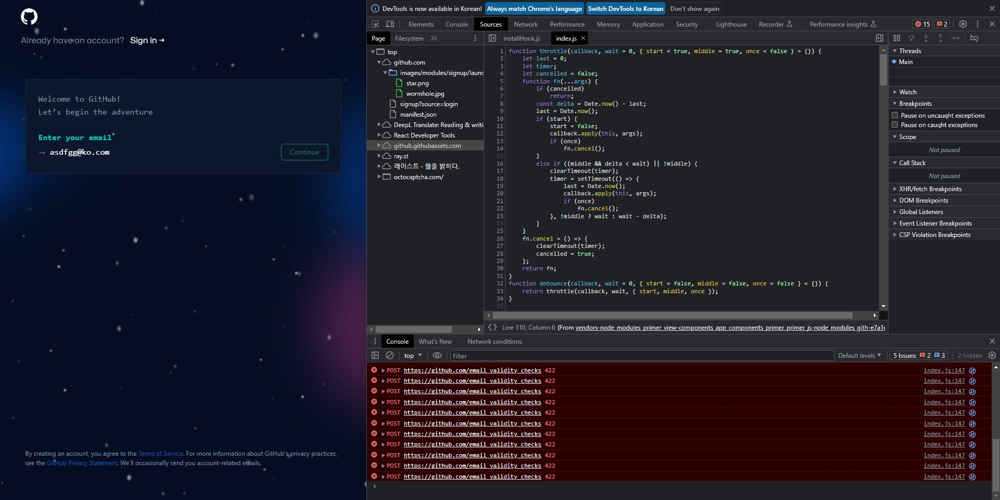

# 유효성 검사 실패 시 400(Bad Request)? 아니면 422(Unprocessable Entity)?

## MDN

### 400(Bad Request)

MDN 문서([링크](https://developer.mozilla.org/ko/docs/Web/HTTP/Status/400)) 설명

> HyperText Transfer Protocol (HTTP) 400 Bad Request 응답 상태 코드는 서버가 클라이언트 오류(예: 잘못된 요청 구문, 유효하지 않은 요청 메시지 프레이밍, 또는 변조된 요청 라우팅) 를 감지해 요청을 처리할 수 없거나, 하지 않는다는 것을 의미합니다.

### 422(Unprocessable Entity)

MDN 문서([링크](https://developer.mozilla.org/ko/docs/Web/HTTP/Status/422)) 설명

> 이 응답은 서버가 요청을 이해하고 요청 문법도 올바르지만 요청된 지시를 따를 수 없음을 나타냅니다.

## 정리

400은 `문법적(Syntatically)`으로 틀린 경우, 422는 `의미론적(Semantically)`으로 틀린 경우를 의미하므로, `유효성 검사 실패 시에는 422를 사용`합니다.

## 사용 예

### Github 회원가입

참고자료: [Quora-Which HTTP code is best suited for validation errors: 400 or 422?](https://www.quora.com/Which-HTTP-code-is-best-suited-for-validation-errors-400-or-422)