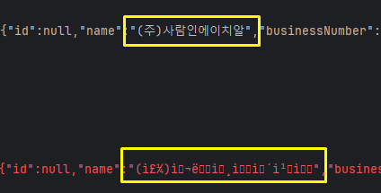
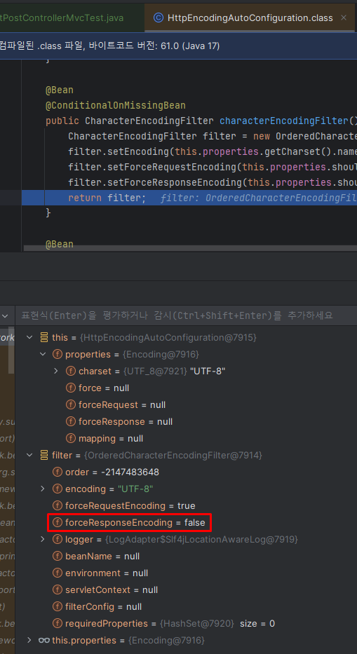
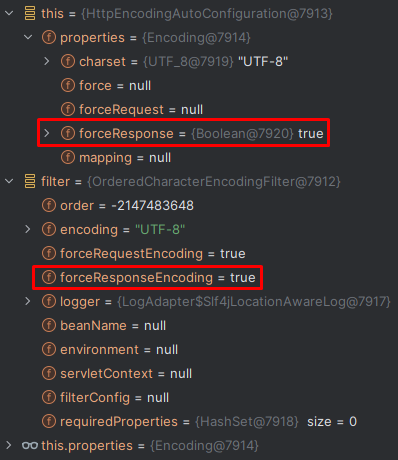

# Spring @WebMvcTest 응답 한글 깨짐 현상 해결방법

## 현상

`MockHttpServletResponse`에서는 정상적으로 한글이 표시되는데, `AssertionError`가 발생한 곳을 보면 한글이 깨진 상태입니다.



## 원인

`HttpEncodingAutoConfiguration`에서 응답에 대해 UTF-8을 강제로 설정하지 않습니다.



## 해결방법

`application.yml` 또는 `application.properties` 파일에서 응답도 강제하도록 설정합니다.

```yaml
server:
  servlet:
    encoding:
      force-response: true
```

```properties
server.servlet.encoding.force-response=true
```



출처: [HomoEfficio / dev-tips](https://github.com/HomoEfficio/dev-tips/blob/master/Spring%20Test%20MockMvc%EC%9D%98%20%ED%95%9C%EA%B8%80%20%EA%B9%A8%EC%A7%90%20%EC%B2%98%EB%A6%AC.md)